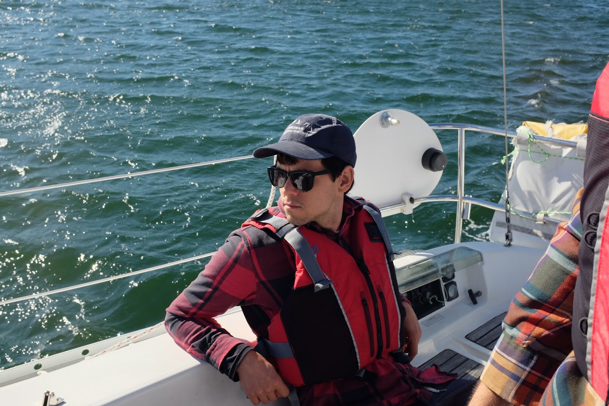
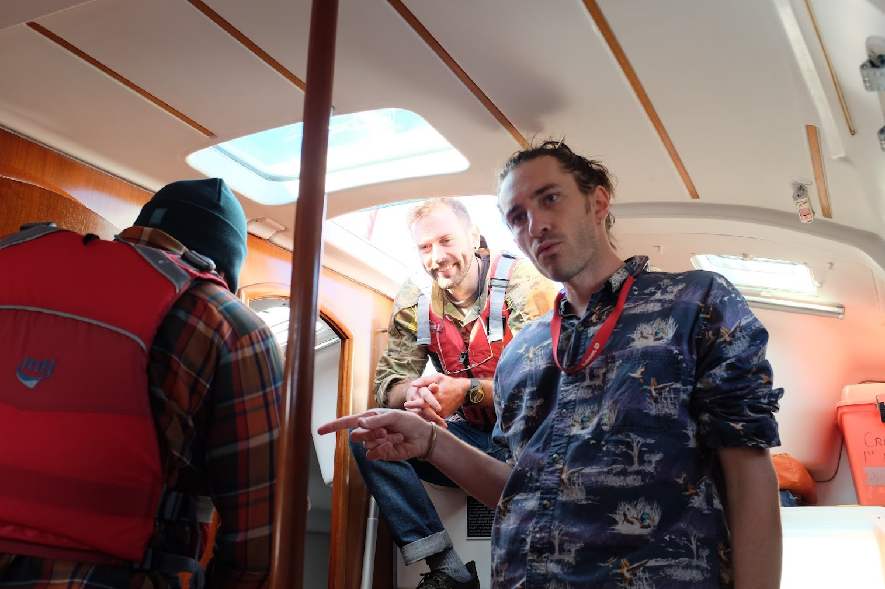

<iframe width="640" height="480" src="https://www.youtube.com/embed/e6QUKsEezGw" title="Sarah Davachi - Alas, Departing" frameborder="0" allow="accelerometer; autoplay; clipboard-write; encrypted-media; gyroscope; picture-in-picture" allowfullscreen></iframe>

[[aesthetic]] 
[[Alejandra]] 

[[NEBDR 2022]] 
[[NEBDR 2022]] 
[[NEBDR 2022]] 
[[NEBDR 2022]] 
[[NEBDR 2022]] 
[[NEBDR 2022]] 
[[NEBDR 2022]] 
[[NEBDR 2022]] 

[[aesthetic]] 

[[Garden]] 

[[Garden]] 
[[Upstream Tech]] 
[[Alejandra]] 

[[sail to little calf island]] 
[[sail to little calf island]] 
[[sail to little calf island]] 
[[sail to little calf island]] 
[[sail to little calf island]] 
[[sail to little calf island]] 
[[sail to little calf island]] 
[[sail to little calf island]] 
[[sail to little calf island]] 
[[sail to little calf island]] 
[[sail to little calf island]] 
[[sail to little calf island]] 
[[sail to little calf island]] 
[[sail to little calf island]] 
[[sail to little calf island]] 
[[sail to little calf island]] 
[[sail to little calf island]] 
[[sail to little calf island]] 

[[Dax]] 

[[Garden]] 
[[aesthetic]] 
[[Garden]] 
[[Garden]] 
[[Garden]] 
[[Garden]] 

[[Garden]] 

[[Dax]] 
[[Dax]] 
[[Dax]] 

[[Dax]] 

[[Alejandra]] 
[[Alejandra]] 

[[Garden]] 
[[Garden]] 
[[aesthetic]] 
[[reading list]] 

[[Alejandra]] 

[[Dax]] 
[[Dax]] 
[[Dax]] 

[[Alejandra]] 

[[Alejandra]] 

[[Aesthetic]] 

[[aesthetic]] 
[[Garden]] 
[[Garden]] 
[[Garden]] 
[[Garden]] 
[[Dax]] 
[[Run to Salem]] 
[[Run to Salem]] 
[[Run to Salem]] 
[[Run to Salem]] 
[[Run to Salem]] 
[[Run to Salem]] 
[[Run to Salem]] 
[[Run to Salem]] 
[[Run to Salem]] 
[[Run to Salem]] 
[[Run to Salem]] 
[[Run to Salem]] 
[[Run to Salem]] 
[[Run to Salem]] 
[[Run to Salem]] 
[[Run to Salem]] 
[[Run to Salem]] 
[[Garden]] 

[[Dax]] 
[[Dax]] 
[[garden]] 
[[Dax]] 
[[the fells]] 
[[garden]] 

[[sunday marathon 2021]] 
[[sunday marathon 2021]] 
[[sunday marathon 2021]] 
[[sunday marathon 2021]] 
[[sunday marathon 2021]] 
[[sunday marathon 2021]] 
[[sunday marathon 2021]] 
[[sunday marathon 2021]] 
[[sunday marathon 2021]] 
[[Garden]] 
[[Garden]] 
[[Garden]] 
[[the fells]] 
[[Garden]] 
[[Dax]] 
[[Garden]] 
[[Dax]] 
[[Dax]] 
[[Dax]] 
[[Garden]] 
[[Dax]] 
[[aesthetic]] 
