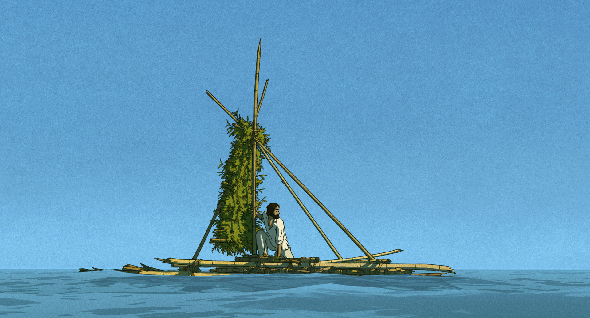

Welcome to [[mmx]]. This started as a blank canvas for my digital identity, and has evolved into a place to log ephemera, share my projects, conduct fun experiments, and write.

I started and run a climate and conservation company, [[Upstream Tech]]. I also make [[music]], [[garden|grow living things]], and have a number of technical and non-technical [[Projects]], hobbies and interests.

This site is my place to [[writing|write]], keep [[Wiki|notes]], share [[log|ephemera]], and write about my [[projects]].

I live in Medford, MA with Alejandra, our newborn Meadow, and dog Dax in our home.

---

## Recently

- [[Recently, January 2023]]
- [[Self-hosted Mastodon]]
- [[Running a basement server]]

## Active projects

- Continuing to explore and evolve this site, [[mmx]]
- Growing [[Upstream Tech]]

## Contact

- Email : [m@mrshll.com](mailto:m@mrshll.com)
- Fediverse : [@mrshll@werm.world](https://werm.world/@mrshll)
